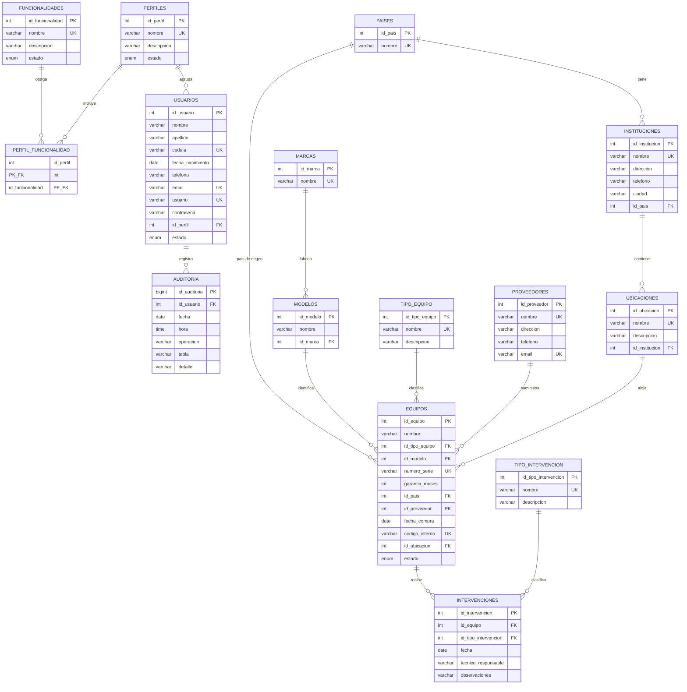

# 01 - Diagrama Entidad-Relacion (MER)

**Sistema:** Gestion de Equipamiento Clinico Hospitalario

## Leyenda de relaciones

| Relacion | Cardinalidad | Comentario |
|----------|--------------|------------|
| pais -> institucion | 1:N | un pais tiene muchas instituciones |
| institucion -> ubicacion | 1:N | una institucion tiene muchas ubicaciones |
| perfil -> usuario | 1:N | un perfil agrupa muchos usuarios |
| perfil <-> funcionalidad | N:N | tabla `perfil_funcionalidad` |
| usuario -> auditoria | 1:N (nullable) | `ON DELETE SET NULL` |
| marca -> modelo | 1:N | todo modelo pertenece a una marca |
| tipo equipo / modelo / pais / proveedor / ubicacion -> equipo | N:1 | equipo con todas sus FK |
| equipo -> intervencion | 1:N | historial de intervenciones |
| tipo intervencion -> intervencion | 1:N | |

## Diagrama (Mermaid)

## Reglas de negocio reflejadas en el MER

1. Un equipo no puede existir sin tipo, modelo, pais, proveedor ni ubicacion
   (todas sus claves foraneas son NOT NULL).
2. Un modelo pertenece a exactamente una marca; de ahi se deriva la marca del
   equipo (3FN).
3. Una ubicacion pertenece a una institucion, y la institucion a un pais.
4. Las intervenciones son historicas: siempre referencian un equipo y un tipo
   de intervencion existentes.
5. La auditoria conserva la referencia al usuario aun si este se elimina
   (`ON DELETE SET NULL`).
